# Diagramas y Flujos de Usuario - OctoFit Tracker

## Diagramas de Casos de Uso

### 1. Gestión de Usuarios
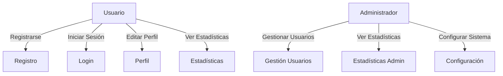

### 2. Gestión de Actividades
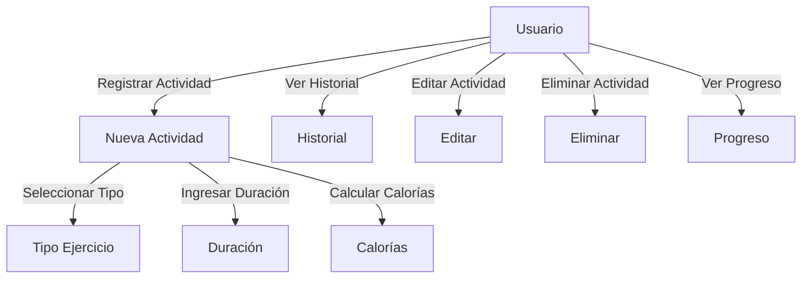

### 3. Gestión de Equipos
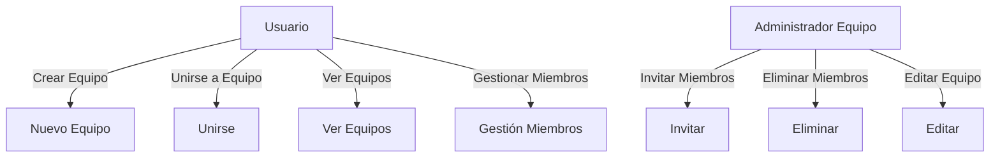

## Flujos de Usuario

### 1. Registro e Inicio de Sesión
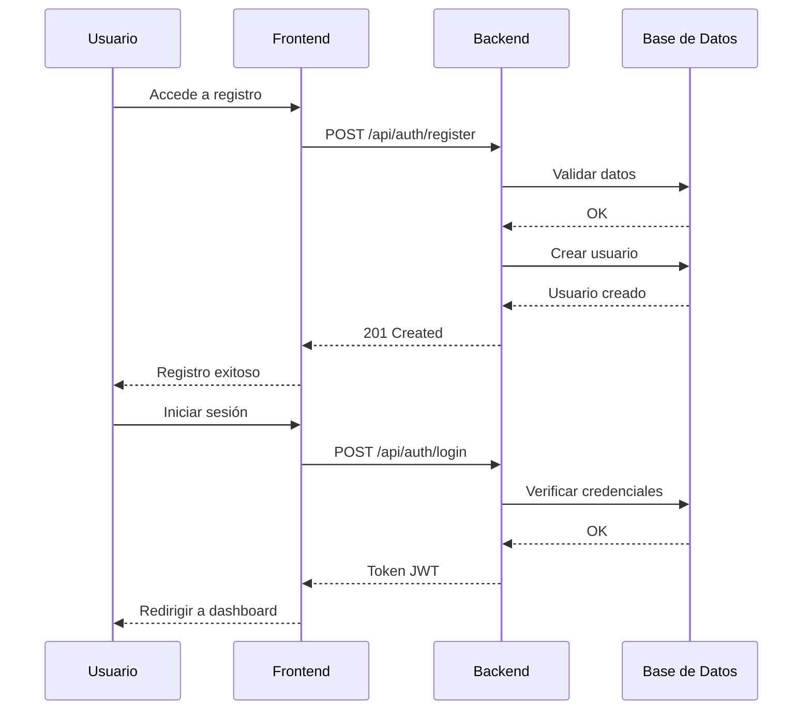

### 2. Registro de Actividad
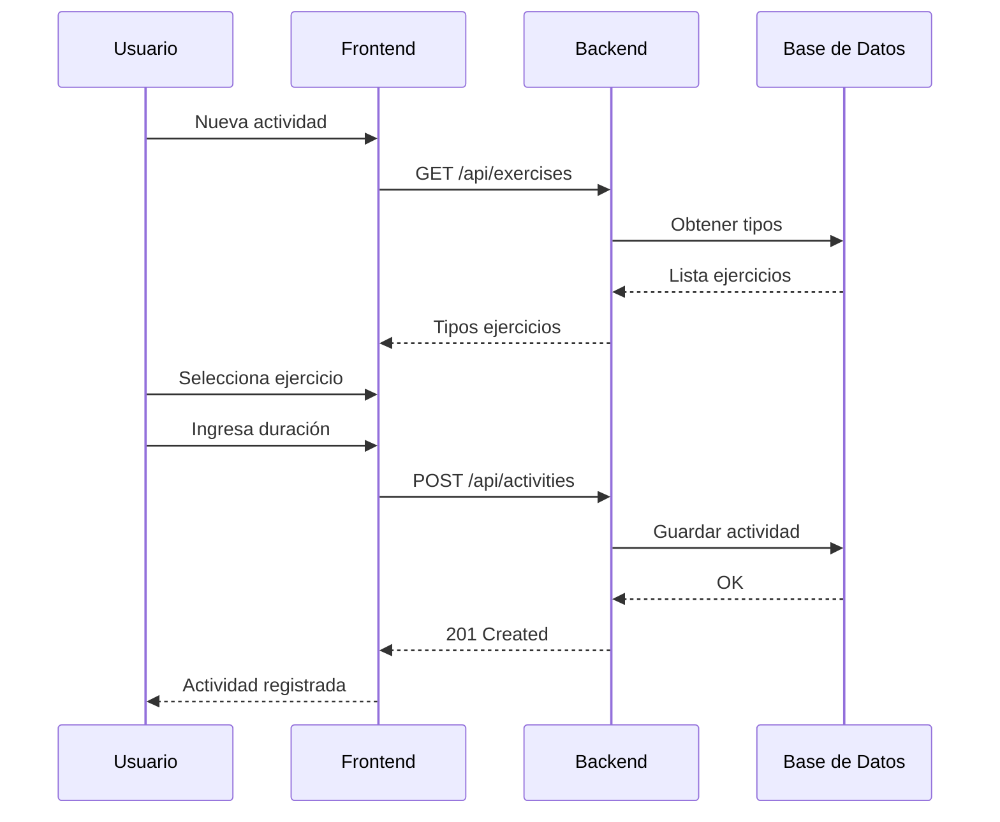

### 3. Gestión de Equipos
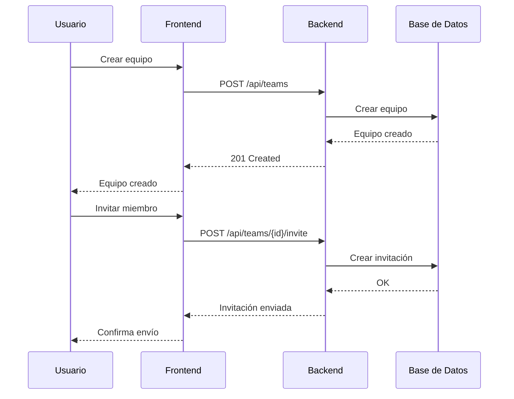

## Flujo de Datos

### 1. Arquitectura General
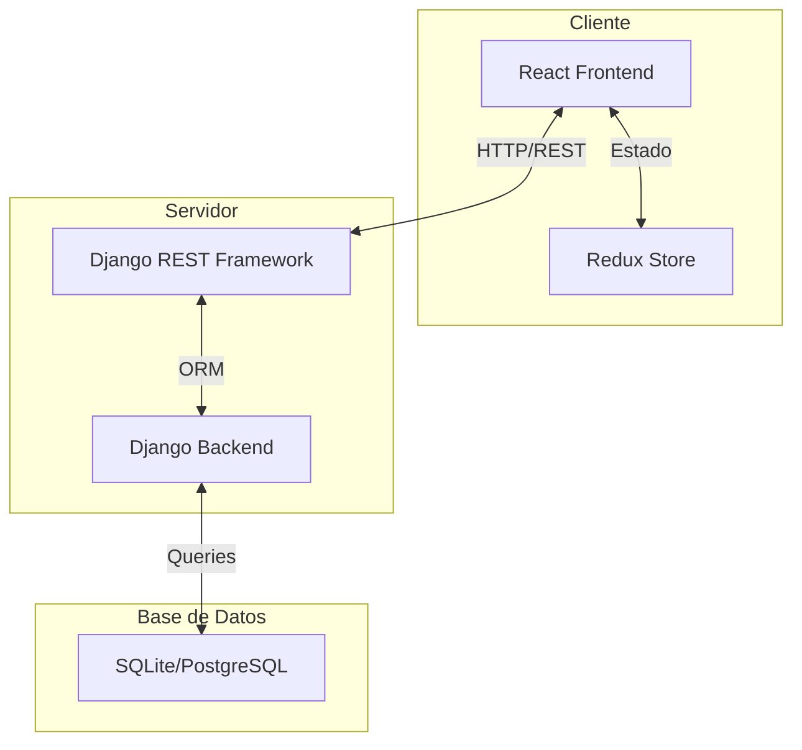

### 2. Flujo de Autenticación
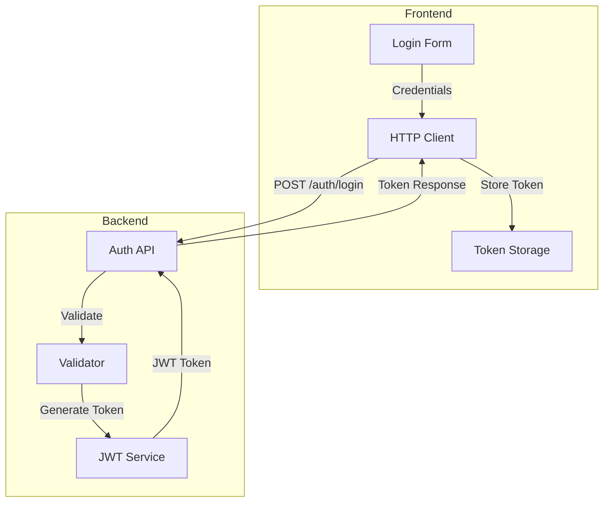

## Estados de Usuario

### 1. Máquina de Estados de Actividad
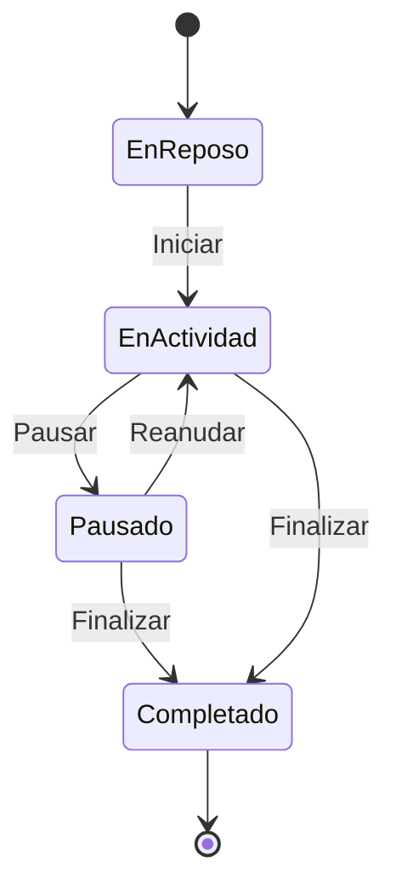

### 2. Máquina de Estados de Equipo
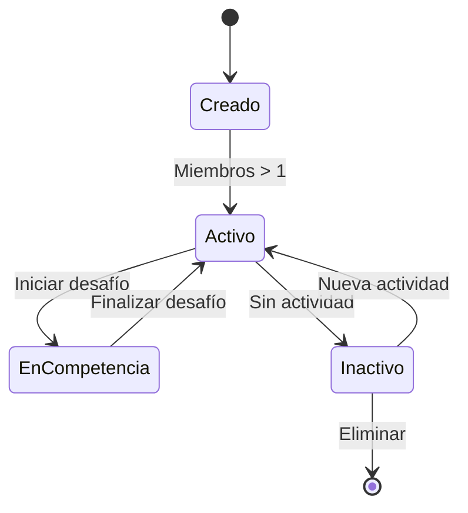

## Modelo de Datos

### 1. Diagrama Entidad-Relación
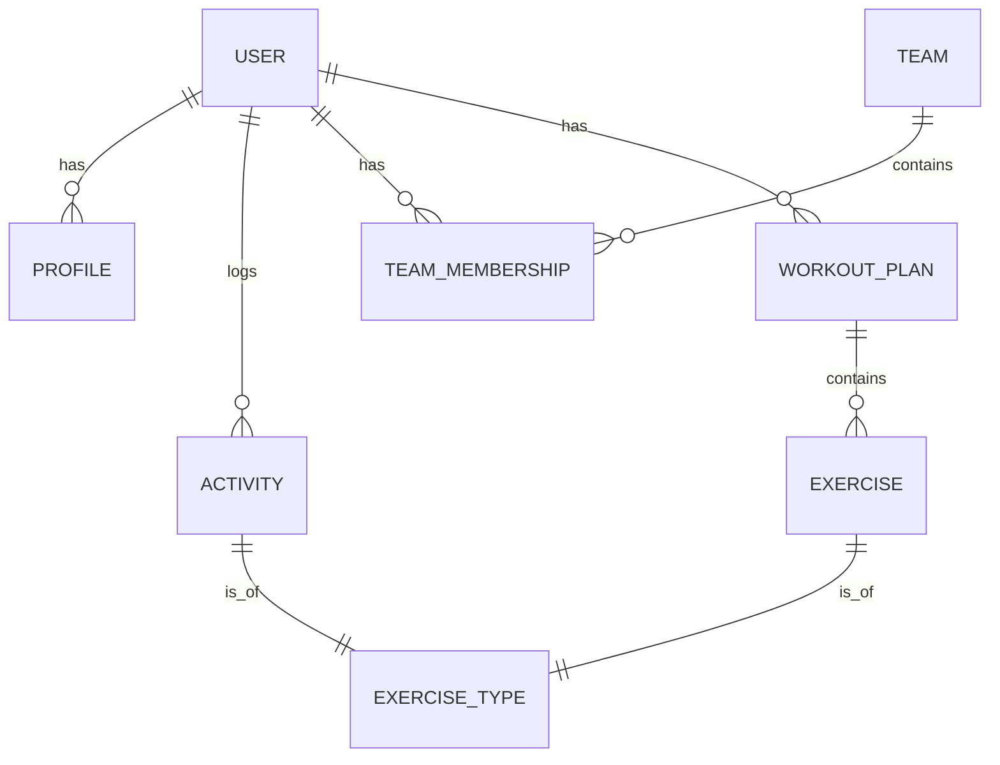

### 2. Jerarquía de Componentes Frontend
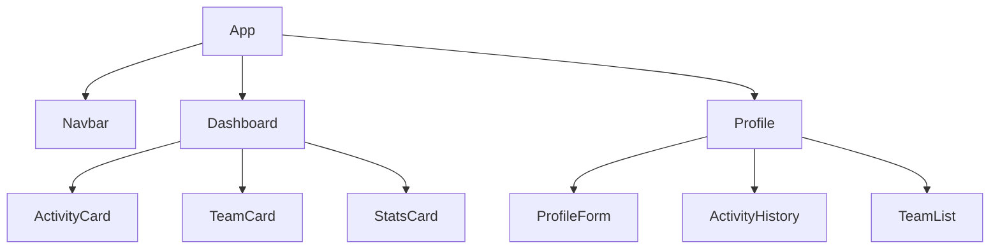

## Procesos de Negocio

### 1. Cálculo de Puntos
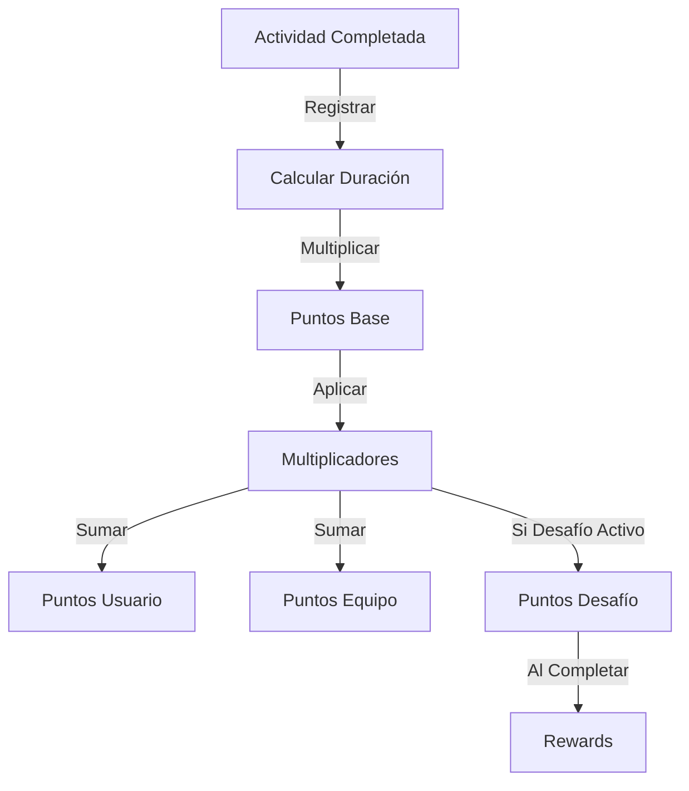

### 2. Sistema de Logros
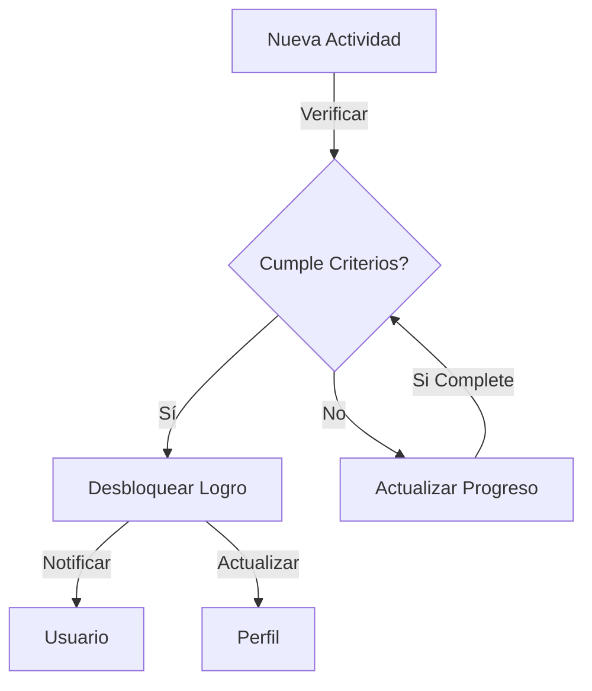