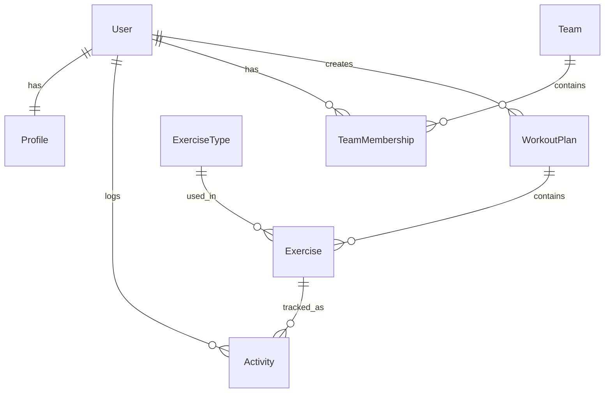

# Modelos de Datos - OctoFit Tracker

## Diagrama de Relaciones



## Modelos Base

### User (Usuario)
Extiende el modelo de usuario de Django.

**Campos Base:**
- `id`: Integer (Auto-incrementable)
- `username`: String (Único)
- `email`: String (Email)
- `password`: String (Hash)
- `first_name`: String
- `last_name`: String
- `is_active`: Boolean
- `date_joined`: DateTime

### Profile (Perfil)
Extensión del modelo de usuario.

**Campos:**
- `user`: OneToOneField → User
- `height`: Float (cm)
- `weight`: Float (kg)
- `fitness_goal`: String
  - Opciones: 'LOSE_WEIGHT', 'GAIN_MUSCLE', 'IMPROVE_ENDURANCE', 'MAINTAIN'
- `activity_level`: String
  - Opciones: 'SEDENTARY', 'LIGHT', 'MODERATE', 'VERY_ACTIVE', 'EXTRA_ACTIVE'
- `points`: Integer (Default: 0)
- `level`: Integer (Default: 1)

## Modelos de Equipo

### Team (Equipo)
Grupos de usuarios para entrenamiento colaborativo.

**Campos:**
- `id`: Integer (Auto-incrementable)
- `name`: String (max_length=100)
- `description`: Text
- `is_private`: Boolean (Default: False)
- `created_at`: DateTime (auto_now_add)
- `updated_at`: DateTime (auto_now)

### TeamMembership (Membresía)
Relación entre usuarios y equipos.

**Campos:**
- `id`: Integer (Auto-incrementable)
- `team`: ForeignKey → Team
- `user`: ForeignKey → User
- `role`: String
  - Opciones: 'ADMIN', 'MEMBER'
- `joined_at`: DateTime (auto_now_add)

## Modelos de Ejercicio

### ExerciseType (Tipo de Ejercicio)
Catálogo de ejercicios disponibles.

**Campos:**
- `id`: Integer (Auto-incrementable)
- `name`: String (max_length=100)
- `description`: Text
- `category`: String
  - Opciones: 'CARDIO', 'STRENGTH', 'FLEXIBILITY', 'BALANCE'
- `difficulty_level`: String
  - Opciones: 'BEGINNER', 'INTERMEDIATE', 'ADVANCED'
- `calories_per_hour`: Integer
- `created_at`: DateTime (auto_now_add)

### WorkoutPlan (Plan de Entrenamiento)
Plan estructurado de ejercicios.

**Campos:**
- `id`: Integer (Auto-incrementable)
- `name`: String (max_length=100)
- `description`: Text
- `created_by`: ForeignKey → User
- `duration_weeks`: Integer
- `difficulty_level`: String
  - Opciones: 'BEGINNER', 'INTERMEDIATE', 'ADVANCED'
- `created_at`: DateTime (auto_now_add)
- `updated_at`: DateTime (auto_now)

### Exercise (Ejercicio)
Ejercicio específico dentro de un plan.

**Campos:**
- `id`: Integer (Auto-incrementable)
- `workout_plan`: ForeignKey → WorkoutPlan
- `exercise_type`: ForeignKey → ExerciseType
- `sets`: Integer (nullable)
- `reps`: Integer (nullable)
- `duration_minutes`: Integer
- `day_of_week`: Integer (1-7)
- `order`: Integer

### Activity (Actividad)
Registro de actividades realizadas.

**Campos:**
- `id`: Integer (Auto-incrementable)
- `user`: ForeignKey → User
- `exercise_type`: ForeignKey → ExerciseType
- `workout_plan`: ForeignKey → WorkoutPlan (opcional)
- `duration_minutes`: Integer
- `calories_burned`: Integer
- `date`: Date
- `notes`: Text
- `created_at`: DateTime (auto_now_add)

## Reglas de Negocio

### Permisos y Roles
1. **Equipos:**
   - Solo los administradores pueden editar/eliminar equipos
   - Cualquier usuario puede crear equipos
   - Equipos privados solo visibles para miembros

2. **Planes de Entrenamiento:**
   - El creador tiene control total
   - Otros usuarios pueden ver y copiar planes públicos

3. **Actividades:**
   - Usuarios solo pueden ver/editar sus propias actividades
   - Los entrenadores pueden ver actividades de su equipo

### Cálculos Automáticos

1. **Calorías Quemadas:**
   ```python
   calories = (activity.duration_minutes / 60) * exercise_type.calories_per_hour
   ```

2. **Puntos de Usuario:**
   ```python
   points = base_points * difficulty_multiplier * duration_multiplier
   ```

3. **Nivel de Usuario:**
   ```python
   level = 1 + (total_points // points_per_level)
   ```

## Validaciones

1. **Ejercicios:**
   - Duración > 0
   - Sets y reps ≥ 0
   - Day of week entre 1-7

2. **Planes:**
   - Duration_weeks > 0
   - Al menos un ejercicio

3. **Actividades:**
   - Duration_minutes > 0
   - Calories_burned ≥ 0
   - Date no futura
    Activity ||--|| ExerciseType : is_of
    User ||--o{ WorkoutPlan : has
    WorkoutPlan ||--o{ Exercise : contains
```

## Modelos Principales

### Usuario (User)
Extiende el modelo User de Django
```python
from django.contrib.auth.models import User

# Los campos heredados incluyen:
# - username
# - email
# - password
# - first_name
# - last_name
```

### Perfil (Profile)
```python
class Profile(models.Model):
    user = models.OneToOneField(User, on_delete=models.CASCADE)
    height = models.FloatField(help_text="Altura en centímetros")
    weight = models.FloatField(help_text="Peso en kilogramos")
    birth_date = models.DateField()
    fitness_goal = models.CharField(max_length=50, choices=FITNESS_GOALS)
    activity_level = models.CharField(max_length=50, choices=ACTIVITY_LEVELS)
    created_at = models.DateTimeField(auto_now_add=True)
    updated_at = models.DateTimeField(auto_now=True)
```

### Equipo (Team)
```python
class Team(models.Model):
    name = models.CharField(max_length=100)
    description = models.TextField()
    created_by = models.ForeignKey(User, on_delete=models.PROTECT)
    is_private = models.BooleanField(default=False)
    created_at = models.DateTimeField(auto_now_add=True)
    updated_at = models.DateTimeField(auto_now=True)
```

### Membresía de Equipo (TeamMembership)
```python
class TeamMembership(models.Model):
    user = models.ForeignKey(User, on_delete=models.CASCADE)
    team = models.ForeignKey(Team, on_delete=models.CASCADE)
    role = models.CharField(max_length=50, choices=TEAM_ROLES)
    joined_at = models.DateTimeField(auto_now_add=True)
```

### Tipo de Ejercicio (ExerciseType)
```python
class ExerciseType(models.Model):
    name = models.CharField(max_length=100)
    description = models.TextField()
    category = models.CharField(max_length=50, choices=EXERCISE_CATEGORIES)
    calories_per_hour = models.IntegerField()
    difficulty_level = models.CharField(max_length=50, choices=DIFFICULTY_LEVELS)
```

### Actividad (Activity)
```python
class Activity(models.Model):
    user = models.ForeignKey(User, on_delete=models.CASCADE)
    exercise_type = models.ForeignKey(ExerciseType, on_delete=models.PROTECT)
    duration = models.IntegerField(help_text="Duración en minutos")
    calories_burned = models.IntegerField()
    date = models.DateField()
    notes = models.TextField(blank=True)
    created_at = models.DateTimeField(auto_now_add=True)
```

### Plan de Entrenamiento (WorkoutPlan)
```python
class WorkoutPlan(models.Model):
    user = models.ForeignKey(User, on_delete=models.CASCADE)
    name = models.CharField(max_length=100)
    description = models.TextField()
    difficulty_level = models.CharField(max_length=50, choices=DIFFICULTY_LEVELS)
    created_at = models.DateTimeField(auto_now_add=True)
    updated_at = models.DateTimeField(auto_now=True)
```

### Ejercicio (Exercise)
```python
class Exercise(models.Model):
    workout_plan = models.ForeignKey(WorkoutPlan, on_delete=models.CASCADE)
    exercise_type = models.ForeignKey(ExerciseType, on_delete=models.PROTECT)
    sets = models.IntegerField()
    reps = models.IntegerField()
    duration = models.IntegerField(help_text="Duración en minutos", null=True, blank=True)
    order = models.IntegerField()
```

## Constantes y Opciones

```python
FITNESS_GOALS = [
    ('weight_loss', 'Pérdida de peso'),
    ('muscle_gain', 'Ganancia muscular'),
    ('endurance', 'Resistencia'),
    ('flexibility', 'Flexibilidad'),
    ('general_fitness', 'Fitness general'),
]

ACTIVITY_LEVELS = [
    ('sedentary', 'Sedentario'),
    ('light', 'Actividad ligera'),
    ('moderate', 'Actividad moderada'),
    ('very_active', 'Muy activo'),
    ('extra_active', 'Extra activo'),
]

TEAM_ROLES = [
    ('member', 'Miembro'),
    ('admin', 'Administrador'),
    ('coach', 'Entrenador'),
]

EXERCISE_CATEGORIES = [
    ('cardio', 'Cardiovascular'),
    ('strength', 'Fuerza'),
    ('flexibility', 'Flexibilidad'),
    ('balance', 'Equilibrio'),
    ('hiit', 'HIIT'),
]

DIFFICULTY_LEVELS = [
    ('beginner', 'Principiante'),
    ('intermediate', 'Intermedio'),
    ('advanced', 'Avanzado'),
]
```

## Validaciones y Signals

Se implementarán los siguientes signals:

1. Crear perfil automáticamente al crear un usuario
2. Actualizar calorías quemadas al guardar una actividad
3. Validar roles de equipo al crear/modificar membresías
4. Actualizar estadísticas de usuario al registrar actividades

## Índices de Base de Datos

Se crearán índices para:
1. Búsqueda de actividades por usuario y fecha
2. Búsqueda de equipos por nombre
3. Búsqueda de ejercicios por categoría y dificultad
4. Búsqueda de planes de entrenamiento por usuario

## Permisos y Seguridad

1. Solo los administradores pueden crear/modificar tipos de ejercicio
2. Los usuarios solo pueden ver/modificar sus propias actividades
3. Los miembros del equipo pueden ver actividades del equipo
4. Los entrenadores pueden crear planes para sus equipos