# 🏪 Tienda Moderna - Plataforma E-Commerce de Indumentaria

## 📖 Descripción del Proyecto

**Tienda Moderna** es una plataforma de comercio electrónico empresarial diseñada para la venta de indumentaria. El proyecto implementa una arquitectura limpia (Clean Architecture) siguiendo los principios SOLID, priorizando la mantenibilidad, escalabilidad y seguridad a largo plazo.

### 🎯 Objetivo Principal
Crear una solución robusta que permita gestionar un catálogo de productos de indumentaria con capacidad de actualización masiva mediante archivos Excel, ofreciendo una experiencia de usuario moderna y segura tanto para clientes como para administradores.

---

## 🚀 Inicio Rápido

### 📚 Documentación Completa Disponible

Este proyecto cuenta con documentación exhaustiva lista para usar:

| Documento | Descripción | ¿Para Quién? |
|-----------|-------------|--------------|
| **[docs/INDICE.md](./docs/INDICE.md)** | 📑 Índice maestro de toda la documentación | ⭐ Comienza aquí |
| **[docs/RESUMEN_EJECUTIVO.md](./docs/RESUMEN_EJECUTIVO.md)** | 📊 Vista completa del proyecto | Todos |
| **[docs/guia-implementacion-backend.md](./docs/guia-implementacion-backend.md)** | 🛠️ Comandos paso a paso para crear el backend | Desarrolladores |
| **[docs/codigo-completo-domain-layer.md](./docs/codigo-completo-domain-layer.md)** | 💻 Código completo de entidades (Parte 1) | Desarrolladores |
| **[docs/codigo-completo-domain-layer-parte2.md](./docs/codigo-completo-domain-layer-parte2.md)** | 💻 Código completo de órdenes/usuarios (Parte 2) | Desarrolladores |
| **[docs/codigo-completo-domain-layer-parte3.md](./docs/codigo-completo-domain-layer-parte3.md)** | 💻 Código completo de interfaces (Parte 3) | Desarrolladores |

### 🎓 ¿Primera Vez en el Proyecto?

**Sigue este orden:**

```mermaid
graph LR
    A[📑 INDICE.md] --> B[📊 RESUMEN_EJECUTIVO.md]
    B --> C[📖 Este README]
    C --> D[🛠️ guia-implementacion-backend.md]
    D --> E[💻 Implementar código]
```



1. **[Lee el ÍNDICE](./docs/INDICE.md)** para navegar toda la documentación
2. **[Lee el RESUMEN EJECUTIVO](./docs/RESUMEN_EJECUTIVO.md)** para entender la arquitectura completa
3. **Continúa con este README** para detalles técnicos
4. **[Sigue la GUÍA DE IMPLEMENTACIÓN](./docs/guia-implementacion-backend.md)** para crear el proyecto

### ⚡ Implementación Rápida

**Ya tienes .NET 8 SDK instalado:**
```bash
# Navega a backend/
cd tienda-moderna/backend

# Ejecuta los comandos de la guía de implementación
# Ver: docs/guia-implementacion-backend.md
```

**Todo el código está listo para copiar:**
- ✅ 8 Entidades completas con métodos de negocio
- ✅ 6 Interfaces de repositorios
- ✅ 3 Enumeraciones
- ✅ Comentarios exhaustivos en español
- ✅ Decisiones arquitectónicas documentadas

### 📦 Estado Actual

| Componente | Estado | Ubicación |
|------------|--------|-----------|
| Documentación | ✅ Completa | `docs/` |
| Arquitectura | ✅ Definida | Este README |
| Domain Layer | ✅ Código listo | `docs/codigo-completo-*` |
| Infrastructure Layer | ⏳ Por implementar | Pendiente |
| Application Layer | ⏳ Por implementar | Pendiente |
| API Layer | ⏳ Por implementar | Pendiente |
| Frontend Vue 3 | ⏳ Por implementar | Pendiente |
| Docker Setup | ✅ Configurado | `docker-compose.yml` |

---

## 🏗️ Arquitectura del Sistema

### Decisiones Arquitectónicas

**¿Por qué Clean Architecture?**
- **Separación de responsabilidades**: Cada capa tiene un propósito específico y bien definido
- **Independencia de frameworks**: La lógica de negocio no depende de tecnologías externas
- **Testabilidad**: Facilita la creación de pruebas unitarias y de integración
- **Mantenibilidad**: Los cambios en una capa no afectan a las demás

**¿Por qué .NET 8?**
- Versión LTS (Long Term Support) con soporte hasta noviembre 2026
- Rendimiento optimizado y menor consumo de recursos
- Mejoras en Entity Framework Core
- Soporte nativo para contenedores y Kubernetes

**¿Por qué Vue 3?**
- Composition API más intuitiva y reutilizable
- Mejor rendimiento que Vue 2
- TypeScript nativo
- Ecosistema maduro y activo

---

## 📦 Estructura del Proyecto

```
tienda-moderna/
├── backend/                          # Aplicación .NET 8 Backend
│   ├── TiendaModerna.API/           # 🎯 Capa de Presentación
│   │   ├── Controllers/             # Controladores REST API
│   │   ├── Middlewares/             # Middleware personalizado (errores, logs)
│   │   └── Program.cs               # Configuración de la aplicación
│   │
│   ├── TiendaModerna.Application/   # 📋 Capa de Aplicación
│   │   ├── Services/                # Servicios de lógica de negocio
│   │   ├── DTOs/                    # Data Transfer Objects
│   │   ├── Interfaces/              # Contratos de servicios
│   │   ├── Validators/              # Validaciones con FluentValidation
│   │   └── Mappings/                # Perfiles de AutoMapper
│   │
│   ├── TiendaModerna.Domain/        # 🏛️ Capa de Dominio
│   │   ├── Entities/                # Entidades del negocio
│   │   ├── Enums/                   # Enumeraciones
│   │   ├── Interfaces/              # Contratos de repositorios
│   │   └── Specifications/          # Especificaciones de consultas
│   │
│   ├── TiendaModerna.Infrastructure/ # 🔧 Capa de Infraestructura
│   │   ├── Data/                    # DbContext y configuraciones EF
│   │   ├── Repositories/            # Implementación de repositorios
│   │   ├── UnitOfWork/              # Patrón Unit of Work
│   │   └── Services/                # Servicios de infraestructura (Email, Storage)
│   │
│   └── TiendaModerna.Shared/        # 🛠️ Utilidades Compartidas
│       ├── Constants/               # Constantes del sistema
│       ├── Exceptions/              # Excepciones personalizadas
│       └── Helpers/                 # Clases auxiliares
│
├── frontend/                         # Aplicación Vue 3 Frontend
│   ├── src/
│   │   ├── components/              # Componentes reutilizables
│   │   │   ├── common/              # Botones, Modales, etc.
│   │   │   ├── productos/           # ProductCard, ProductList
│   │   │   └── carrito/             # Cart, CartItem
│   │   ├── views/                   # Páginas principales
│   │   │   ├── public/              # Catálogo público
│   │   │   └── admin/               # Panel administrativo
│   │   ├── stores/                  # Pinia stores (estado global)
│   │   ├── services/                # Servicios API (Axios)
│   │   ├── composables/             # Lógica reutilizable
│   │   ├── router/                  # Configuración de rutas
│   │   └── assets/                  # Recursos estáticos
│   └── public/                      # Archivos públicos
│
├── docs/                            # 📚 Documentación del Proyecto
│   ├── arquitectura.md              # Documentación de arquitectura
│   ├── api-endpoints.md             # Documentación de APIs
│   ├── modelos-datos.md             # Diagramas de entidades
│   └── guia-desarrollo.md           # Guía para desarrolladores
│
├── docker-compose.yml               # Orquestación de contenedores
├── .gitignore                       # Archivos ignorados por Git
└── README.md                        # Este archivo
```

---

## 🚀 Características Principales

### ✨ Funcionalidades Core

#### 1. **Gestión de Productos**
- CRUD completo con validaciones robustas
- Soporte para múltiples imágenes por producto
- Sistema de variantes (tallas, colores)
- Control de stock por variante
- **Importación masiva desde archivos Excel (.xlsx)**
- Categorización multinivel
- Gestión de marcas

#### 2. **Catálogo Público**
- Visualización responsive de productos
- Filtros avanzados (categoría, precio, talla, color, marca)
- Búsqueda inteligente con autocompletado
- Ordenamiento flexible (precio, fecha, popularidad)
- Paginación optimizada
- Vista de detalle con zoom de imágenes

#### 3. **Sistema de Descuentos y Promociones**
- Descuentos por producto individual
- Descuentos por categoría completa
- Sistema de cupones con validaciones
- Ofertas con límite de tiempo
- Descuentos por cantidad (mayorista)

#### 4. **Carrito de Compras**
- Carrito persistente (localStorage)
- Actualización en tiempo real
- Validación de stock disponible
- Cálculo automático de descuentos
- Estimación de costos de envío

#### 5. **Procesamiento de Órdenes**
- Generación de órdenes de compra
- Seguimiento de estados
- Historial de compras
- Notificaciones por email
- Integración con pasarelas de pago (preparado)

#### 6. **Panel Administrativo Seguro**
- Dashboard con métricas y KPIs
- Gestión completa de productos
- Gestión de órdenes y estados
- Gestión de clientes
- **Importación masiva desde Excel**
- Generación de reportes de ventas
- Control de inventario

#### 7. **Seguridad Empresarial**
- Autenticación JWT con refresh tokens
- Autorización basada en roles (Admin, Vendedor, Cliente)
- Validación de datos en backend y frontend
- Protección contra CSRF, XSS, SQL Injection
- Rate limiting para prevenir ataques
- Logs de auditoría
- Encriptación de contraseñas con bcrypt

---

## 💻 Stack Tecnológico

### Backend
- **Framework**: .NET 8 (LTS)
- **ORM**: Entity Framework Core 8
- **Base de Datos**: MySQL 8.0
- **Autenticación**: JWT (JSON Web Tokens)
- **Documentación API**: Swagger/OpenAPI
- **Mapeo de Objetos**: AutoMapper
- **Validaciones**: FluentValidation
- **Importación Excel**: EPPlus / ClosedXML

### Frontend
- **Framework**: Vue 3 (Composition API)
- **State Management**: Pinia
- **Routing**: Vue Router 4
- **HTTP Client**: Axios
- **UI Framework**: Tailwind CSS / Bootstrap 5
- **Build Tool**: Vite
- **TypeScript**: Soporte completo

### DevOps
- **Contenedores**: Docker & Docker Compose
- **CI/CD**: GitLab CI/CD (preparado)
- **Orquestación**: Kubernetes / OpenShift (preparado)

---

## 🎨 Patrones de Diseño Implementados

### 1. **Repository Pattern**
**¿Por qué?**: Abstrae el acceso a datos, facilita testing y cambios de base de datos
```csharp
// Interfaz genérica reutilizable
public interface IRepositorioGenerico<T> where T : class
{
    Task<T> ObtenerPorIdAsync(int id);
    Task<IEnumerable<T>> ObtenerTodosAsync();
    Task AgregarAsync(T entidad);
    void Actualizar(T entidad);
    void Eliminar(T entidad);
}
```

### 2. **Unit of Work Pattern**
**¿Por qué?**: Agrupa operaciones en una transacción, garantiza consistencia
```csharp
// Coordina múltiples repositorios en una transacción
public interface IUnitOfWork : IDisposable
{
    IRepositorioProducto Productos { get; }
    IRepositorioCategoria Categorias { get; }
    Task<int> GuardarCambiosAsync();
}
```

### 3. **Dependency Injection**
**¿Por qué?**: Reduce acoplamiento, facilita testing y mantenimiento
```csharp
// Los servicios reciben sus dependencias en el constructor
public class ServicioProducto : IServicioProducto
{
    private readonly IUnitOfWork _unitOfWork;
    private readonly IMapper _mapper;
    
    public ServicioProducto(IUnitOfWork unitOfWork, IMapper mapper)
    {
        _unitOfWork = unitOfWork;
        _mapper = mapper;
    }
}
```

### 4. **DTO Pattern**
**¿Por qué?**: Separa modelos de dominio de modelos de transferencia, mayor seguridad
```csharp
// No exponemos las entidades directamente al cliente
public class ProductoDTO
{
    public int Id { get; set; }
    public string Nombre { get; set; }
    public decimal Precio { get; set; }
    // Sin datos sensibles como fechas de auditoría, relaciones complejas, etc.
}
```

---

## 🔒 Principios SOLID Aplicados

### **S - Single Responsibility Principle (Responsabilidad Única)**
Cada clase tiene una única razón para cambiar. Ejemplos:
- `ServicioProducto`: Solo gestiona lógica de productos
- `RepositorioProducto`: Solo acceso a datos de productos
- `ValidadorProducto`: Solo validaciones de productos

### **O - Open/Closed Principle (Abierto/Cerrado)**
Extensible sin modificar código existente:
- Uso de interfaces para nuevos comportamientos
- Estrategias de descuento implementables sin cambiar el core

### **L - Liskov Substitution Principle (Sustitución de Liskov)**
Las implementaciones pueden sustituirse sin romper el código:
- `IRepositorioGenerico<T>` puede ser reemplazado por cualquier implementación

### **I - Interface Segregation Principle (Segregación de Interfaces)**
Interfaces específicas en lugar de generales:
- `IServicioProducto`, `IServicioCategoria` separados
- No interfaces "god" con todo mezclado

### **D - Dependency Inversion Principle (Inversión de Dependencias)**
Dependencias en abstracciones, no en concreciones:
- Controllers dependen de `IServicioProducto`, no de implementación concreta
- Facilita testing con mocks

---

## 🗄️ Modelo de Datos

### Entidades Principales

**Producto**
- Id, Nombre, Descripción, Precio, PrecioOriginal
- IdCategoria, IdMarca
- FechaCreación, FechaModificación
- Relaciones: Categoría, Marca, Variantes, Imágenes

**Variante**
- Id, IdProducto, Talla, Color
- PrecioAdicional, Stock
- SKU único

**Categoría**
- Id, Nombre, Descripción
- IdCategoriaPadre (para multinivel)
- Activo

**Orden**
- Id, IdUsuario, NumeroOrden
- Total, Subtotal, Descuento, Envío
- Estado, FechaPedido
- Relaciones: DetallesOrden, Usuario

---

## 🚦 Cómo Empezar

### Prerrequisitos
- .NET 8 SDK
- Node.js 18+
- MySQL 8.0
- Docker Desktop (opcional)

### Instalación con Docker (Recomendado)

```bash
# Clonar repositorio
git clone <url-repositorio>
cd tienda-moderna

# Iniciar todos los servicios
docker-compose up -d

# Acceder a:
# Frontend: http://localhost:3000
# Backend API: http://localhost:5000
# Swagger: http://localhost:5000/swagger
```

### Instalación Manual

Ver documentación detallada en `docs/guia-desarrollo.md`

---

## 📚 Documentación Adicional

- [Arquitectura del Sistema](docs/arquitectura.md)
- [Endpoints de la API](docs/api-endpoints.md)
- [Modelos de Datos](docs/modelos-datos.md)
- [Guía de Desarrollo](docs/guia-desarrollo.md)

---

## 👥 Contribución

Este proyecto sigue las mejores prácticas empresariales. Para contribuir:
1. Seguir los principios SOLID
2. Documentar decisiones arquitectónicas
3. Incluir tests unitarios
4. Comentar código en español

---

## 📝 Licencia

MIT License - Proyecto Educativo/Empresarial

---

**Desarrollado con** ❤️ **siguiendo arquitectura empresarial y principios SOLID**
