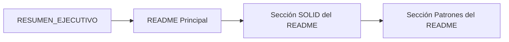
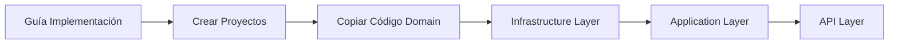

# 📚 Índice de Documentación - Tienda Moderna

Bienvenido a la documentación completa del proyecto **Tienda Moderna**. Este índice te ayudará a navegar por todos los documentos disponibles.

---

## 🎯 Comienza Aquí

Si es tu primera vez en el proyecto, sigue este orden:

1. **[RESUMEN_EJECUTIVO.md](./RESUMEN_EJECUTIVO.md)** ⭐ **COMIENZA AQUÍ**
   - Visión general del proyecto
   - Stack tecnológico
   - Arquitectura completa
   - Estado actual y próximos pasos

2. **[../README.md](../README.md)**
   - Introducción detallada
   - Principios SOLID explicados
   - Patrones de diseño
   - Modelo de datos

3. **[guia-implementacion-backend.md](./guia-implementacion-backend.md)**
   - Comandos para crear proyectos .NET
   - Paquetes NuGet necesarios
   - Estructura de carpetas
   - Orden de implementación

---

## 📂 Documentación por Categoría

### 🏗️ Arquitectura y Configuración

| Documento | Descripción | Cuándo Leerlo |
|-----------|-------------|---------------|
| [RESUMEN_EJECUTIVO.md](./RESUMEN_EJECUTIVO.md) | Vista completa del proyecto | ⭐ Primero |
| [../README.md](../README.md) | Documentación principal | Después del resumen |
| [guia-implementacion-backend.md](./guia-implementacion-backend.md) | Setup del backend | Antes de crear proyectos |
| [../docker-compose.yml](../docker-compose.yml) | Configuración de contenedores | Para ejecutar con Docker |

### 💻 Código del Domain Layer

| Documento | Contenido | Entidades Incluidas |
|-----------|-----------|---------------------|
| [codigo-completo-domain-layer.md](./codigo-completo-domain-layer.md) | Entidades básicas | Producto, Categoria, Variante, Imagen, Marca |
| [codigo-completo-domain-layer-parte2.md](./codigo-completo-domain-layer-parte2.md) | Órdenes y usuarios | Orden, DetalleOrden, Usuario, Enums |
| [codigo-completo-domain-layer-parte3.md](./codigo-completo-domain-layer-parte3.md) | Interfaces | IRepositorioGenerico, IRepositorio*, IUnitOfWork |

---

## 📖 Guía de Lectura por Objetivo

### 🎓 **Objetivo: Entender la Arquitectura**



**Documentos a leer**:
1. `RESUMEN_EJECUTIVO.md` → Sección "Arquitectura del Proyecto"
2. `../README.md` → Sección "Clean Architecture"
3. `../README.md` → Sección "Principios SOLID"

**Tiempo estimado**: 30 minutos

---

### 🛠️ **Objetivo: Implementar el Backend**



**Documentos a leer**:
1. `guia-implementacion-backend.md` → Comandos y setup
2. `codigo-completo-domain-layer.md` → Copiar entidades básicas
3. `codigo-completo-domain-layer-parte2.md` → Copiar órdenes y usuarios
4. `codigo-completo-domain-layer-parte3.md` → Copiar interfaces

**Tiempo estimado**: 2-3 horas

---

### 🧪 **Objetivo: Entender el Modelo de Datos**

**Documentos a leer**:
1. `RESUMEN_EJECUTIVO.md` → Sección "Modelo de Datos"
2. `codigo-completo-domain-layer.md` → Ver entidades completas
3. `../README.md` → Diagrama ER

**Tiempo estimado**: 20 minutos

---

### 🐳 **Objetivo: Ejecutar con Docker**

**Documentos a leer**:
1. `../docker-compose.yml` → Configuración
2. `RESUMEN_EJECUTIVO.md` → Sección "Docker Compose"

**Comandos**:
```bash
cd tienda-moderna
docker-compose up -d
```

**Tiempo estimado**: 10 minutos

---

## 📋 Checklist de Implementación

Marca cada paso a medida que lo completas:

### Fase 1: Preparación
- [ ] Leer `RESUMEN_EJECUTIVO.md`
- [ ] Leer `../README.md`
- [ ] Instalar .NET 8 SDK
- [ ] Instalar MySQL (o usar Docker)
- [ ] Instalar Visual Studio / VS Code

### Fase 2: Crear Estructura
- [ ] Seguir `guia-implementacion-backend.md` - Crear solución
- [ ] Crear 5 proyectos (.Domain, .Application, etc.)
- [ ] Establecer referencias entre proyectos
- [ ] Instalar paquetes NuGet

### Fase 3: Domain Layer
- [ ] Copiar entidades de `codigo-completo-domain-layer.md`
  - [ ] Producto.cs
  - [ ] Categoria.cs
  - [ ] Variante.cs
  - [ ] Imagen.cs
  - [ ] Marca.cs
- [ ] Copiar entidades de `codigo-completo-domain-layer-parte2.md`
  - [ ] Orden.cs
  - [ ] DetalleOrden.cs
  - [ ] Usuario.cs
  - [ ] EstadoOrden.cs (enum)
  - [ ] RolUsuario.cs (enum)
  - [ ] TipoDescuento.cs (enum)
- [ ] Copiar interfaces de `codigo-completo-domain-layer-parte3.md`
  - [ ] IRepositorioGenerico.cs
  - [ ] IRepositorioProducto.cs
  - [ ] IRepositorioCategoria.cs
  - [ ] IRepositorioOrden.cs
  - [ ] IRepositorioUsuario.cs
  - [ ] IUnitOfWork.cs
- [ ] Compilar y verificar (dotnet build)

### Fase 4: Infrastructure Layer
- [ ] Crear TiendaContext.cs (DbContext)
- [ ] Configurar entidades (Fluent API)
- [ ] Implementar RepositorioGenerico
- [ ] Implementar repositorios específicos
- [ ] Implementar UnitOfWork
- [ ] Crear primera migración
- [ ] Aplicar migración a BD

### Fase 5: Application Layer
- [ ] Crear DTOs
- [ ] Configurar AutoMapper
- [ ] Implementar servicios
- [ ] Crear validadores FluentValidation

### Fase 6: API Layer
- [ ] Configurar Program.cs
- [ ] Configurar Swagger
- [ ] Configurar JWT
- [ ] Crear controladores
- [ ] Probar con Swagger

### Fase 7: Frontend (Vue 3)
- [ ] Inicializar proyecto Vite
- [ ] Configurar Pinia
- [ ] Crear componentes
- [ ] Integrar con API

### Fase 8: Docker
- [ ] Crear Dockerfile backend
- [ ] Crear Dockerfile frontend
- [ ] Probar docker-compose

---

## 🔍 Búsqueda Rápida

### ¿Dónde Encuentro...?

| Busco... | Documento | Sección/Línea |
|----------|-----------|---------------|
| Comandos para crear proyectos | `guia-implementacion-backend.md` | "Creación de Proyectos" |
| Código de Producto.cs | `codigo-completo-domain-layer.md` | "Entities/Producto.cs" |
| Código de Orden.cs | `codigo-completo-domain-layer-parte2.md` | "Entities/Orden.cs" |
| Interfaces de repositorios | `codigo-completo-domain-layer-parte3.md` | Todo el archivo |
| Explicación de SOLID | `../README.md` | Sección "Principios SOLID" |
| Explicación de Clean Architecture | `../README.md` | Sección "Clean Architecture" |
| Paquetes NuGet necesarios | `guia-implementacion-backend.md` | "Paquetes NuGet Necesarios" |
| Configuración de Docker | `../docker-compose.yml` | Todo el archivo |
| Modelo de datos (diagramas) | `../README.md` | Sección "Modelo de Datos" |
| Estructura de carpetas | `guia-implementacion-backend.md` | "Estructura Detallada de Carpetas" |

---

## 💡 Consejos de Lectura

### Para Principiantes en Clean Architecture
1. **No te abrumes**: Es normal que parezca mucho código al principio
2. **Lee en orden**: Los documentos están diseñados para leerse secuencialmente
3. **Prueba a medida que avanzas**: Implementa cada capa y pruébala antes de seguir
4. **Los comentarios son tus amigos**: Cada archivo tiene explicaciones detalladas

### Para Desarrolladores Experimentados
1. Puedes saltar directo a `guia-implementacion-backend.md`
2. Los archivos de código están listos para copiar y pegar
3. Revisa las decisiones arquitectónicas en los comentarios (busca "¿POR QUÉ?")
4. Considera qué patrones adicionales agregar según tu experiencia

### Para Arquitectos/Tech Leads
1. Revisa `RESUMEN_EJECUTIVO.md` → Sección "Principios SOLID Aplicados"
2. Valida las decisiones en `guia-implementacion-backend.md`
3. Revisa la estructura de interfaces en `codigo-completo-domain-layer-parte3.md`
4. Considera puntos de extensión para el futuro

---

## 📊 Estadísticas de la Documentación

- **Total de Documentos**: 7 archivos principales
- **Líneas de Código Documentadas**: ~3,000 líneas
- **Entidades Definidas**: 8 entidades completas
- **Interfaces Definidas**: 6 interfaces
- **Tiempo de Lectura Total**: ~2-3 horas
- **Tiempo de Implementación Estimado**: 15-20 horas

---

## 🆘 Problemas Comunes

### "No encuentro el comando dotnet"
**Solución**: Instalar .NET 8 SDK desde https://dot.net

**Documento**: `guia-implementacion-backend.md` tiene los comandos completos

---

### "¿Por dónde empiezo?"
**Solución**: Lee en este orden:
1. `RESUMEN_EJECUTIVO.md`
2. `../README.md`
3. `guia-implementacion-backend.md`

---

### "Hay mucho código, ¿puedo empezar con algo más simple?"
**Solución**: Implementa solo estas entidades primero:
- Producto
- Categoria
- Usuario

Luego agrega el resto incrementalmente.

**Documento**: `guia-implementacion-backend.md` → Sección "Orden de Implementación Recomendado"

---

### "¿Necesito saber todos los patrones antes de empezar?"
**Respuesta**: No. Los patrones están explicados en el código mismo. 

Empieza implementando y aprenderás sobre la marcha.

---

## 📞 Siguiente Paso

Si aún no lo hiciste:

👉 **[Lee el RESUMEN_EJECUTIVO.md](./RESUMEN_EJECUTIVO.md)**

Es el mejor punto de partida para entender todo el proyecto.

---

## 📝 Notas de Versión

- **v1.0** (Enero 2025)
  - Documentación inicial completa
  - Domain Layer totalmente definido
  - Guías de implementación
  - Docker Compose configurado

---

**¿Listo para empezar?** 🚀

```bash
# Paso 1: Lee el resumen ejecutivo
# Paso 2: Instala .NET 8 SDK
# Paso 3: Sigue la guía de implementación
# Paso 4: ¡Construye una tienda increíble!
```
